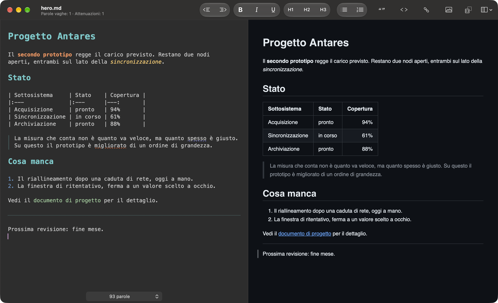

# MacDown

A Markdown editor for macOS, released under the MIT License.

This is a fork of [MacDown](https://github.com/MacDownApp/macdown) by
Tzu-ping Chung, who took the idea from [Chen Luo](https://twitter.com/chenluois)’s
[Mou](http://mouapp.com). It has been brought up to macOS 26 and extended,
around the three things the original left thin: an editor that showed you
the punctuation rather than what it meant, diagrams that did not draw, and
getting a document out of the app in a shape someone else can open.

## Screenshot

## What this fork adds

### Diagrams

* **Mermaid 11.17**, up from the 8.4.3 the original shipped. Flowcharts,
  sequence diagrams, gantt charts, state and class diagrams, and the newer
  types 8.x never had.
* **Graphviz works.** Its bundled script used to replace the whole page body
  with the first graph it drew, taking the rest of the document with it, and
  it stopped redrawing after the first keystroke. Six layout engines —
  `dot`, `neato`, `fdp`, `circo`, `twopi`, `osage` — each its own fence
  language.
* **Zoom and pan on any diagram.** A wide gantt or a large graph is fitted
  to the pane and its labels collide; pinch or ⌃-scroll to magnify, drag to
  pan, double-click to fit again. The zoom survives a refresh, so you keep
  your place while typing.
* **Diagrams follow the appearance**, dark or light, and are **on by
  default** — the libraries are only loaded for documents that use them.

### Export

* **EPUB 3.3.** Images are copied into the package and the table of contents
  is built from the headings.
* **Pictures kept on the web travel too.** A .docx and an EPUB are packages,
  so a picture they do not carry is a picture nobody sees. Both exports fetch
  the remote ones first, with a sheet while they wait and a count of whatever
  could not be had. Turn it off in the preferences if an export must make no
  network requests.
* **Word (.docx) that survives the trip.** AppKit's own writer drops
  pictures, flattens tables into tab-separated paragraphs, loses list
  indentation and code block shading, and names a Mac-only font with nothing
  to substitute it. Each of those is repaired in the file afterwards, so
  tables arrive as tables and code arrives monospaced on Windows too.
* **Diagrams are drawn into every export**, HTML, Word and EPUB alike,
  rather than shipping the source and a library and hoping the reader runs
  JavaScript.

### An editor that draws the Markdown

The editor stops showing you the markup and starts drawing what it means.
None of it touches the file: what you save is the string you typed, to the
character.

* **The markers disappear** until the caret reaches them — emphasis, bold,
  inline code, links, the hashes on a heading and the `>` on a quotation.
  They collapse the moment a construct is finished, and come back the
  moment you work on it.
* **Blocks are laid out**: lists get a hanging indent, quotations get a
  rule down the margin, headings get room above them, and three dashes are
  drawn as a line across the page.
* **Tables are edited by command**, not by hand: right-click one for rows
  and columns, a column's alignment, or a repair of its dashes row. The
  editor shows the source; the columns are drawn in the preview, which has
  the room for them. Click a cell there and the caret goes to that cell.
* **⌘B and ⌘I act on the word under the caret** when nothing is selected,
  and take the markup off again if it is already there.
* **Pasting formatted text produces Markdown** — headings, nested lists,
  links, images, fenced code with its language, quotations, tables. ⌘⇧V
  pastes exactly what was copied.
* Deleting at the start of a heading's text demotes it to a paragraph; at
  the start of a quoted line it unquotes the line.

Every one of these can be switched off in **Preferences › Rendering ›
Writing**.

### Writing

* **A prose checker**: qualifiers, weasel words, hedging, wordiness, passive
  tells and repeated words, in **English and Italian**. The word lists are a
  resource file, editable without rebuilding.
* **A maths editor** for TeX, with a live preview, backed by a bundled
  MathJax — so formulas render with no network.
* **WikiLinks**: `[[Another note]]` links to a neighbouring document, and
  says so when the file is not there.
* **A sidebar** with the document outline, for moving around a long file.

### Appearance

* Built against the macOS 26 SDK, with the window chrome to match: content
  runs the full height under a unified toolbar, which picks up the glass
  material and the scroll edge effect.
* **The preview has a dark mode**, and follows the system.
* **Typing no longer makes the preview flash.** It used to reload the whole
  page on every keystroke.
* **The two panes point at the same place.** Put the caret in a paragraph
  and a rule marks it in the preview; select in the preview and a rule
  marks it in the editor's margin.
* A **new application icon**, and no Touch Bar: the strip is gone from the
  hardware, and every command it carried is on the menu and the toolbar.

## Installing

Builds are on the [releases page](https://github.com/nicolorisitano82/macdown/releases).
Requires macOS 26.

They are **not signed or notarised** — no Developer ID certificate stands
behind them — so macOS will refuse one on a double-click. After dragging the
app to Applications:

    xattr -d com.apple.quarantine /Applications/MacDown.app

Whether to run an unsigned binary from the internet is your call; building
from source is the alternative, and the next section says how.

## License

MacDown is released under the terms of MIT License. You may find the content of the license [here](http://opensource.org/licenses/MIT), or inside the `LICENSE` directory.

You may find full text of licenses about third-party components in the `LICENSE` directory, or the **About MacDown** panel in the application.

The following editor themes and CSS files are extracted from [Mou](http://mouapp.com), courtesy of Chen Luo:

* Mou Fresh Air
* Mou Fresh Air+
* Mou Night
* Mou Night+
* Mou Paper
* Mou Paper+
* Tomorrow
* Tomorrow Blue
* Tomorrow+
* Writer
* Writer+
* Clearness
* Clearness Dark
* GitHub
* GitHub2

## Development

### Requirements

* Xcode 26 or later, for the macOS 26 SDK. The deployment target is macOS
  26.0, so an older SDK will not build this.
* Git
* CocoaPods

> The Command Line Tools alone are not enough. `xcodebuild` refuses to run
> against them:
>
>     xcode-select: error: tool 'xcodebuild' requires Xcode, but active
>     developer directory is a command line tools instance
>
> If Xcode is installed but `xcode-select` points elsewhere, either repoint
> it or set `DEVELOPER_DIR` for the build.

> CocoaPods is easiest from Homebrew — `brew install cocoapods` — which
> brings its own Ruby. The Ruby that ships with macOS is too old for current
> CocoaPods, so `gem install cocoapods` against it tends to end without a
> usable `pod`. The `Gemfile` route works too if you already run a modern
> Ruby.

### Environment Setup

After cloning the repository, run the following inside the repository root:

    git submodule update --init
    pod install
    make -C Dependency/peg-markdown-highlight

and open `MacDown.xcworkspace` — the workspace, not the project; the project
alone has no pods. The first command fetches the dependency submodules, the
second installs the CocoaPods dependencies.

If a build fails later on after pulling, the same two commands usually
account for it:

    git submodule update
    pod install

## Credits

MacDown leans on other open source projects:
[Hoedown](https://github.com/hoedown/hoedown) turns Markdown into HTML,
[Prism](https://prismjs.com) highlights code blocks,
[PEG Markdown Highlight](https://github.com/ali-rantakari/peg-markdown-highlight)
highlights the editor, [mermaid](https://mermaid.js.org) and
[Graphviz](https://graphviz.org), through
[Viz.js](https://github.com/mdaines/viz.js), draw the diagrams, and
[MathJax](https://www.mathjax.org) sets the maths.

They have the credit for the parts they do. Problems you run into here are
still best [reported here](https://github.com/nicolorisitano82/macdown/issues):
telling apart a fault in this fork, in the MacDown it grew out of, and in
something underneath is rarely possible from the outside, and it is not the
reporter's job.
