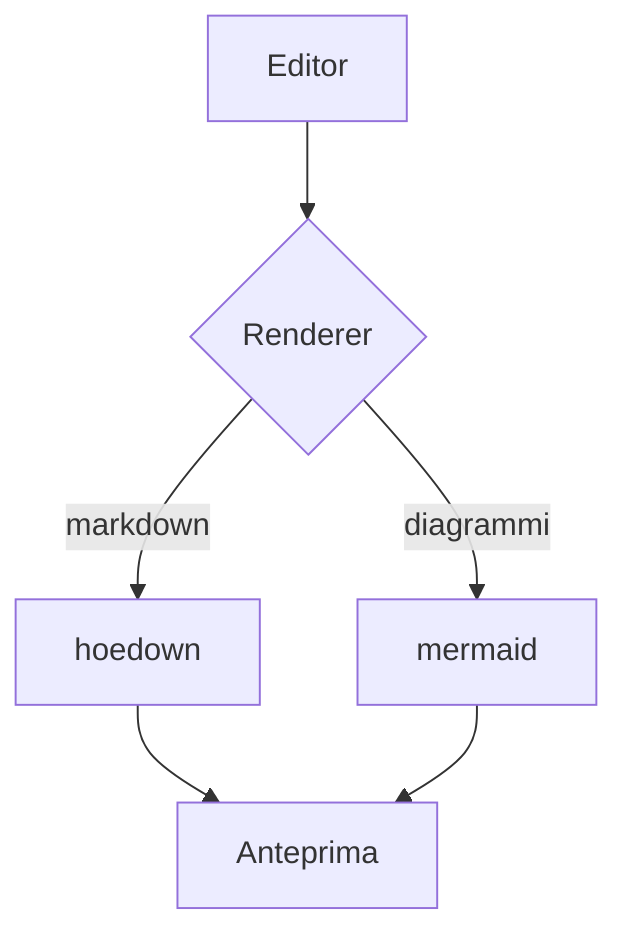
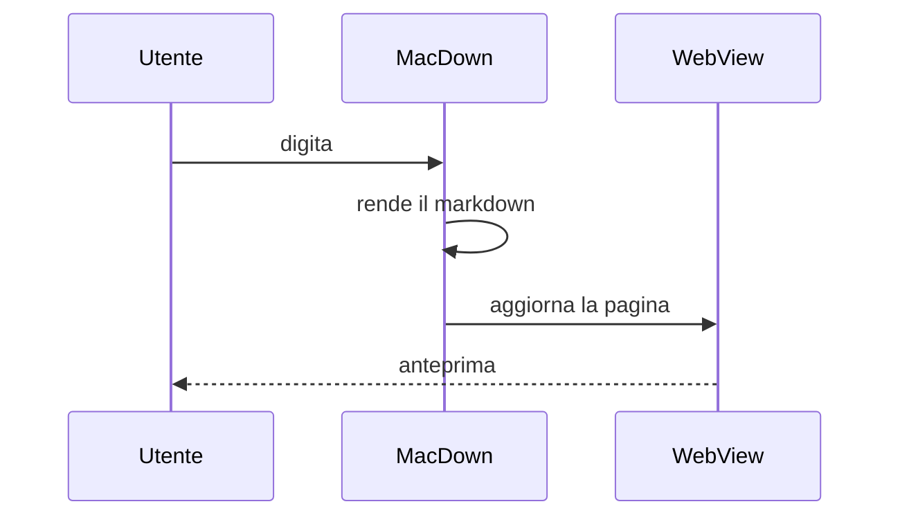
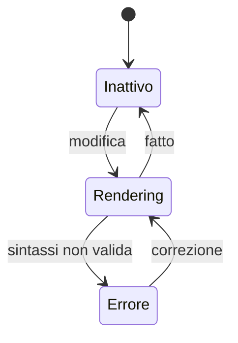
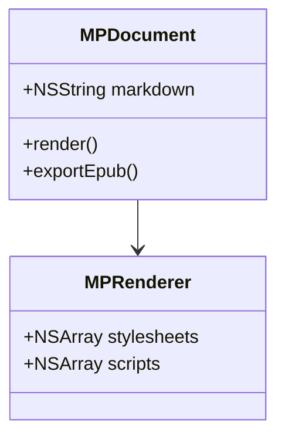
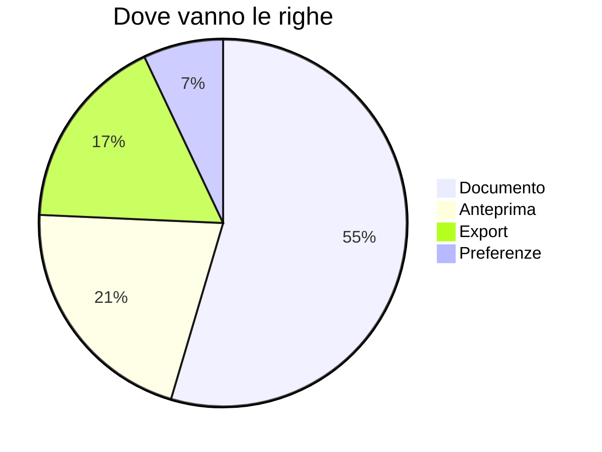
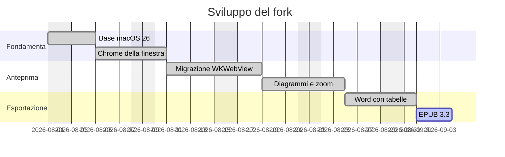

# Diagrammi mermaid

Un blocco di codice con `mermaid` come linguaggio diventa un disegno. Il
tema segue l'aspetto del sistema: in modalità scura i diagrammi sono scuri.

La libreria viene caricata solo per i documenti che contengono un
diagramma, quindi tenere la funzione accesa non rallenta nulla altrove.

## Diagramma di flusso



## Sequenza



## Stati



## Classi



## Torta



## Zoom

Il gantt qui sotto è largo: alla larghezza del pannello le date si
sovrappongono. Passaci sopra e compaiono i comandi in alto a destra —
oppure pizzica sul trackpad, trascina per spostarti, doppio clic per
tornare alla vista intera.



## Errori

Un diagramma con sintassi non valida non porta giù la pagina: al suo posto
compare il messaggio dell'errore, e mentre lo stai scrivendo è normale
vederlo.

```mermaid
graph TD
    A[Manca la parentesi
```
