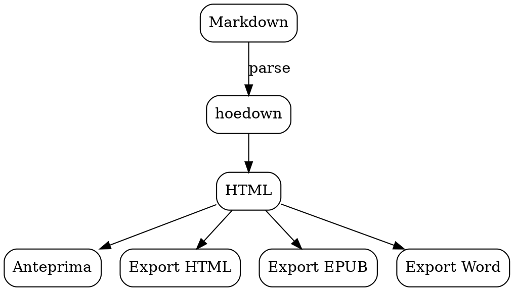

# Grafi Graphviz

Graphviz calcola da sé dove mettere i nodi: tu descrivi solo chi è
collegato a chi. Il linguaggio è DOT, e ogni motore di layout è il
linguaggio di un blocco.

Rispetto a mermaid è più grezzo — nodi e archi e basta — ma regge molto
meglio i grafi grandi e intricati.

## dot — gerarchico

Il più usato: dall'alto in basso, buono per dipendenze e gerarchie.



## neato — a molle

Per grafi non orientati, dove conta la vicinanza e non la gerarchia.

```neato
graph G {
    node [shape=circle];
    Editor -- Anteprima;
    Editor -- Sommario;
    Anteprima -- Diagrammi;
    Anteprima -- Matematica;
    Sommario -- Editor;
}
```

## fdp — a molle, per grafi più grandi

```fdp
graph G {
    node [shape=point, width=0.15];
    a -- b; b -- c; c -- a;
    c -- d; d -- e; e -- c;
    e -- f; f -- g; g -- e;
    g -- a;
}
```

## circo — circolare

Buono per topologie e cicli.

```circo
digraph G {
    Uno -> Due -> Tre -> Quattro -> Cinque -> Uno;
    Uno -> Tre;
    Due -> Cinque;
}
```

## twopi — radiale

Un centro, e tutto il resto in anelli attorno.

```twopi
digraph G {
    root="MacDown Next";
    "MacDown Next" -> Editor;
    "MacDown Next" -> Anteprima;
    "MacDown Next" -> Export;
    Editor -> Prosa;
    Editor -> Evidenziazione;
    Anteprima -> mermaid;
    Anteprima -> Graphviz;
    Export -> EPUB;
    Export -> Word;
}
```

## osage — a gruppi

```osage
digraph G {
    subgraph cluster_editor {
        label="Editor";
        Testo; Prosa;
    }
    subgraph cluster_anteprima {
        label="Anteprima";
        HTML; Diagrammi;
    }
    Testo -> HTML;
}
```

Anche i grafi Graphviz hanno lo zoom, che su un grafo denso serve più che
altrove.
