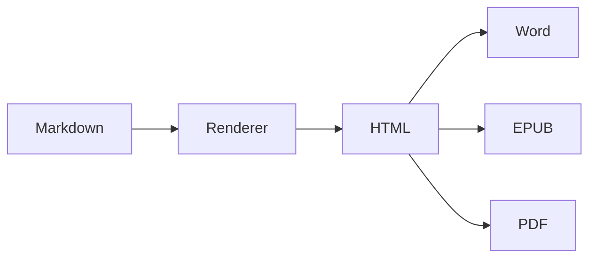

# Esportazione

Questo documento è fatto per essere esportato. Contiene tutto ciò che
storicamente si perdeva per strada: una tabella, un blocco di codice, un
diagramma, una formula.

Prova **File › Export** in HTML, PDF, Word ed EPUB e confronta.

## Cosa arriva dove

| Elemento | HTML | PDF | Word | EPUB |
|---|:---:|:---:|:---:|:---:|
| Testo | sì | sì | sì | sì |
| Titoli | ancore | solo aspetto | stili Word | sommario |
| Tabelle | sì | sì | sì, vere | sì |
| Codice | sì | sì | sì, monospazio | sì |
| Diagrammi | sì | sì | sì, immagini | sì, immagini |
| Formule | sì | sì | sì, immagini | sì, immagini |
| Immagini locali | collegate | incorporate | incorporate | copiate dentro |

## Una tabella

| Trimestre | Ricavi | Margine |
|:----------|-------:|--------:|
| Q1        | 12 400 |   18,2% |
| Q2        | 15 900 |   21,7% |
| Q3        | 14 100 |   19,4% |
| Q4        | 19 750 |   24,1% |

Nel documento Word questa è una tabella vera, con bordi e intestazione
ripetuta se spezza pagina — non righe di testo separate da tabulazioni.

I titoli, dal canto loro, arrivano con gli stili Titolo 1…6 di Word: il
riquadro di navigazione li elenca e un campo Sommario si costruisce da
solo. L'aspetto è quello di qui, perché la formattazione resta diretta e
lo stile serve a Word per capire la struttura, non per disegnarla.

## Del codice

```javascript
function fibonacci(n) {
  let [a, b] = [0, 1];
  const out = [];
  for (let i = 0; i < n; i++) {
    out.push(a);
    [a, b] = [b, a + b];
  }
  return out;
}
```

Nel Word il blocco resta monospazio anche su una macchina senza i font di
macOS, perché il file dichiara un'alternativa a passo fisso.

## Un diagramma



Nelle esportazioni il diagramma diventa un'immagine: il file non porta con
sé la libreria e si vede ovunque.

## Una formula

$$
\sum_{k=1}^{n} k = \frac{n(n+1)}{2}
$$

## Note sull'EPUB

Il documento viaggia come un unico file di contenuto invece di essere
spezzato in capitoli: tagliare sui titoli funziona bene per un libro e male
per degli appunti o un README. L'indice si costruisce dai titoli, quindi la
navigazione c'è comunque.
